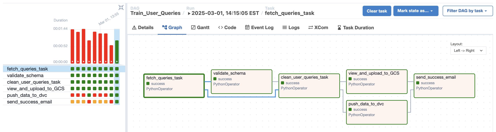
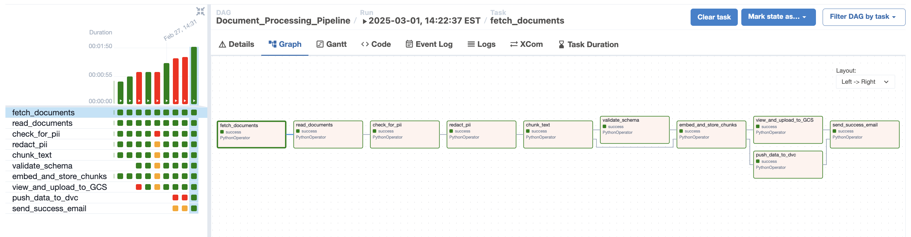
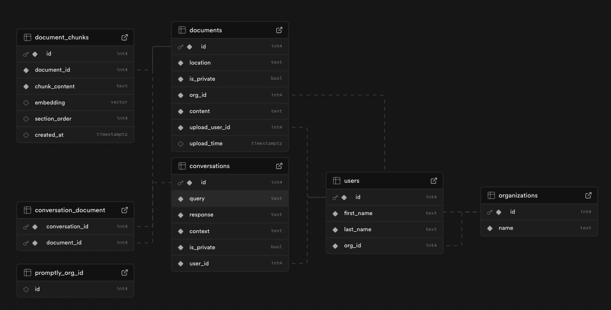
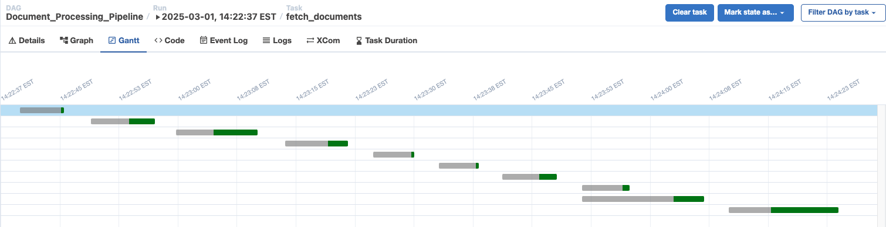

# Promptly Data Pipeline 

## Index

1. [Overview](#overview)
2. [Data Source](#data-source)
2. [Data Pipeline - Key Components & Workflow](#data-pipeline---key-components--workflow)
   - [User Queries Processing Pipeline](#1-user-queries-processing-pipeline)
   - [Document Processing & RAG Pipeline](#2-document-processing--rag-pipeline)
3. [Data Storage](#data-storage)
4. [Airflow DAGs Overview](#airflow-dags-overview)
   - [User Queries DAG](#1-user-queries-dag-train_user_queries)
   - [Document Processing DAG](#2-document-processing-dag-document_processing_pipeline)
5. [Project Directory Structure](#project-directory-structure)
6. [Setup & Deployment](#setup--deployment)
7. [Database Schema](#supabase-database-schema)
8. [Anomaly Detection and Alerts](#anomaly-detection-and-alerts)
9. [Pipeline Flow Optimization](#pipeline-flow-optimization)
10. [CI/CD & Model Versioning](#cicd--model-versioning)
11. [Contributing](#contributing)
12. [License](#license)
13. [Contact](#contact)

Detailed Report can be found in assets folder -> [Project Data Pipeline](<../assets/Promptly Data Pipeline Report.pdf>)  
[Google Doc link](https://docs.google.com/document/d/19Jd8TC3M7WMPvD455YPUJEYhhlibG4G8-F0f75NPTNw/edit?usp=sharing)
## Overview

Promptly is an AI-powered document-based Q&A system designed to retrieve answers from user-uploaded documents (PDFs, text files) using a **Retrieval-Augmented Generation (RAG) pipeline**. The system processes user queries, cleans and validates data, stores embeddings in Supabase, and utilizes **Google Cloud Storage (GCS), Airflow DAGs, and DVC** for **data processing, tracking, and versioning**.

This repository hosts the **data pipeline** for managing document processing, query handling, and RAG workflows.

---

## Data Source
### 1. User Queries
- Source: Retrieved from the conversations table in Supabase.
- Description: This table contains user-generated queries, which we have pre-filled with custom data to simulate various interaction scenarios.

### 2. Documents
- Source: Focused on IT specifications, we have curated data from publicly available requirements documents.
- Description: We have selectively gathered documents that provide detailed IT specifications, particularly from the PURE dataset, which comprises 79 publicly available natural language requirements documents collected from the web.
- Reference: [https://zenodo.org/records/5195084](https://zenodo.org/records/5195084)

---

## Data Pipeline - Key Components & Workflow

### 1. User Queries Processing Pipeline

The pipeline processes user queries from **Supabase** and prepares them for retrieval tasks:

- **Fetch Queries**: Retrieves queries from the Supabase database.
- **Validate Schema**: Ensures that queries match expected format.
- **Clean & Preprocess**: Tokenizes, lemmatizes, and removes noise.
- **Upload to GCS**: Saves processed queries as CSV files in GCS.
- **Push to DVC**: Enables version control for reproducibility.
- **Trigger Model Training** (if needed).
- **Send Notifications**: Sends a success email when tasks complete.


---

### 2. Document Processing & RAG Pipeline

This pipeline processes and indexes uploaded documents for retrieval:

- **Fetch Documents**: Collects uploaded PDFs & text files.
- **Read Documents**: Extracts text content using `pymupdf4llm`.
- **PII Detection & Redaction**: Uses **Presidio-based Named Entity Recognition (NER)** to identify and redact sensitive data.
- **Chunk Text**: Splits documents into structured sections.
- **Validate Schema**: Ensures processed text follows expected format.
- **Embed & Store**:
  - **Generate embeddings** using `Nomic`.
  - **Store in Supabase** (using `pgvector` for semantic search).
- **Upload to GCS**: Saves processed chunks for backup.
- **Push to DVC**: Ensures version control for document processing.
- **Send Notifications**: Triggers email alerts upon completion.


---

## Data Storage

The processed data is stored across multiple locations:

- **Google Cloud Storage (GCS)**: Stores raw & processed data.
- **Supabase**: Hosts document metadata & vector embeddings for retrieval.
- **DVC (Data Version Control)**: Tracks dataset versions for reproducibility.

---

## Airflow DAGs Overview

### 1. **User Queries DAG (Train_User_Queries)**

Processes user queries and prepares them for retrieval:

- `fetch_queries_task`: Retrieves queries from Supabase.
- `validate_schema`: Ensures data consistency.
- `clean_user_queries_task`: Cleans and preprocesses queries.
- `view_and_upload_to_GCS`: Saves processed data to GCS.
- `push_data_to_dvc`: Tracks query versions in DVC.
- `send_success_email`: Notifies of completion.

### 2. **Document Processing DAG (Document_Processing_Pipeline)**

Processes uploaded PDFs and prepares them for retrieval:

- `fetch_documents`: Retrieves documents.
- `read_documents`: Extracts text from PDFs/TXT files.
- `check_for_pii`: Detects sensitive information.
- `redact_pii`: Redacts or masks sensitive data.
- `chunk_text`: Splits text into meaningful chunks.
- `validate_schema`: Ensures chunked data structure is valid.
- `embed_and_store_chunks`: Generates embeddings and stores them in Supabase.
- `view_and_upload_to_GCS`: Uploads processed chunks to GCS.
- `push_data_to_dvc`: Tracks query versions in DVC.
- `send_success_email`: Notifies of completion.

---

## Project Directory Structure

```
├── assets/
│   ├── process_user_queries_dag.png  # User Query Pipeline Worflow Diagram
│   ├── rag_data_pipeline_dag.png  # Data Pipeline Workflow Diagram
│
├── data_pipeline/
│   ├── dags/
│   │   ├── dataPipeline.py  # User Queries DAG
│   │   ├── rag_data_pipeline.py  # Document Processing DAG
│   │   ├── scripts/
│   │   │   ├── email_utils.py  # Email notifications
│   │   │   ├── upload_data_GCS.py  # GCS Uploading
│   │   │   ├── data_preprocessing/
│   │   │   │   ├── check_pii_data.py  # PII Detection
│   │   │   │   ├── validate_schema.py  # Schema Validation
│   │   │   │   ├── data_utils.py  # Query Cleaning Functions
│   │   │   ├── supadb/
│   │   │   │   ├── supabase_utils.py  # Supabase Integration
│   │   │   ├── rag/
│   │   │   │   ├── validate_schema.py  # Schema Validation
│   │   │   │   ├── rag_utils.py  # Chunking & Embeddings
│   │   ├── tests/
│   │   │   ├── test_data_pii_redact.py  # Unit tests for PII detection and redaction
│   │   │   ├── test_rag_pipeline.py  # Unit tests for the RAG document chunking pipeline
│   │   │   ├── test_user_queries.py  # Unit tests for the user queries processing pipeline
│   ├── config.py  # API Keys & Configurations
│   ├── README.md  # Data Pipeline Documentation
│
├── data/
│   ├── rag_documents/  # Original PDFs & Text Files
│   ├── preprocessed_docs_chunks.csv/  # Cleaned & Chunked Data
│   ├── preprocessed_user_data.csv  # Processed User Queries
│
├── .dvc/  # DVC Configuration
├── .gitignore
├── .dvcignore
├── README.md  # Project Overview
├── requirements.txt  # Dependencies
```
---

## **Setup & Deployment**

### **Prerequisites**

Ensure you have the following installed:

- **Google Cloud SDK** (`gcloud` CLI)
- **Python 3.8+**
- **DVC** (`pip install dvc[gdrive]`)
- **Airflow** (`pip install apache-airflow`)

### **1. Environment Setup**

1. Clone the repository:
   ```bash
   git clone https://github.com/your-repo/promptly-data-pipeline.git
   cd promptly-data-pipeline
   ```
2. Install dependencies:
   ```bash
   pip install -r requirements.txt
   ```
3. Set up Google Cloud authentication:
   ```bash
   gcloud auth login
   gcloud auth application-default login
   For SSL certificate auth: export SSL_CERT_FILE=$(python -m certifi)
   ```
4. Initialize DVC:
   ```bash
   dvc init
   dvc remote add gcs_remote gs://promptly-chat
   dvc pull
   ```

### **2. Running Airflow DAGs**

1. Start Airflow:
   ```bash
   airflow db init
   airflow scheduler & airflow webserver
   ```
2. Trigger DAGs via the Airflow UI or CLI:
   ```bash
   airflow dags trigger Train_User_Queries
   airflow dags trigger Document_Processing_Pipeline
   ```

### **3. Monitoring & Logs**

- Check Airflow logs:
  ```bash
  airflow tasks logs <dag_id> <task_id>
  ```
- Supabase logs can be viewed via the web dashboard.

---

## Supabase Database Schema

- We are using Supabase as our database and embedding store to store user conversations, documents and embedding chunks.
- Our project has 6 Tables:
   - users
   - organizations
   - documents
   - document_chunks
   - conversations
   - conversation_document
- Here's the full view of schema:



---

## Anomaly Detection and Alerts

- We have written custom code to detect any anomalies in our data pipeline.
- Missing Data Checks: Handled in validate_schema.py.
- Unexpected Formats Detection: Managed in validate_schema.py and data_utils.py.
- Anomaly Alerts: Sends email notifications for irregularities.

---

## Pipeline Flow Optimization

- We have tracked the Gantt chart for both  DAGs that we have created, we make sure that every task is modular and consumes minimal time for execution.
- We have also implemented parallelization in some of our later processing functions.
- We have optimized our resources to optimise the cost and wait time for each pipeline task.(for example, reducing time from 5min->3min for one of the DAGs)



---

## **CI/CD & Model Versioning**

- **DVC tracks dataset versions** for reproducibility.
- **GitHub Actions (future enhancement)** handles automated deployments.
- **MLflow (future enhancement)** for tracking model performance.

---

## **Contributing**

We welcome contributions to improve this pipeline! To contribute:

1. Fork this repository.
2. Create a new branch.
3. Commit changes and push them.
4. Submit a Pull Request.

---

## **License**

Distributed under the MIT License. See `LICENSE.txt` for more details.

---

## **Contact**

For any questions or issues, reach out to the Promptly team:

- **Ronak Vadhaiya** - vadhaiya.r@northeastern.edu
- **Sagar Bilwal** - bilwal.sagar@northeastern.edu
- **Kushal Shankar** - kushalshankar03@gmail.com
- **Rajiv Shah** - shah.rajiv1702@gmail.com
